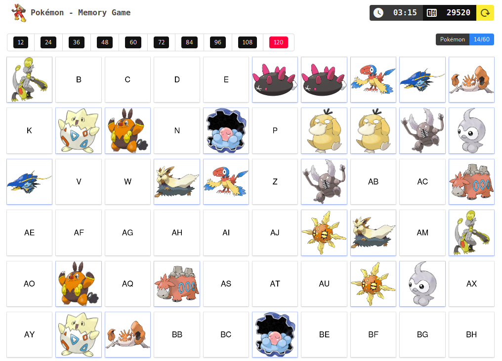

# Pokémon - Memory Game

A simple memory game using pokémon.



## Resources used

- [Vue.js (PWA)](https://vuejs.org)
- [Buefy](https://buefy.org/)
- [Bulma CSS](https://bulma.io/)
- [Material Design Icons](https://materialdesignicons.com/)

## Commands
```shell
yarn install // install deps
yarn run serve // serve app in port 80
yarn run build // build app
```
